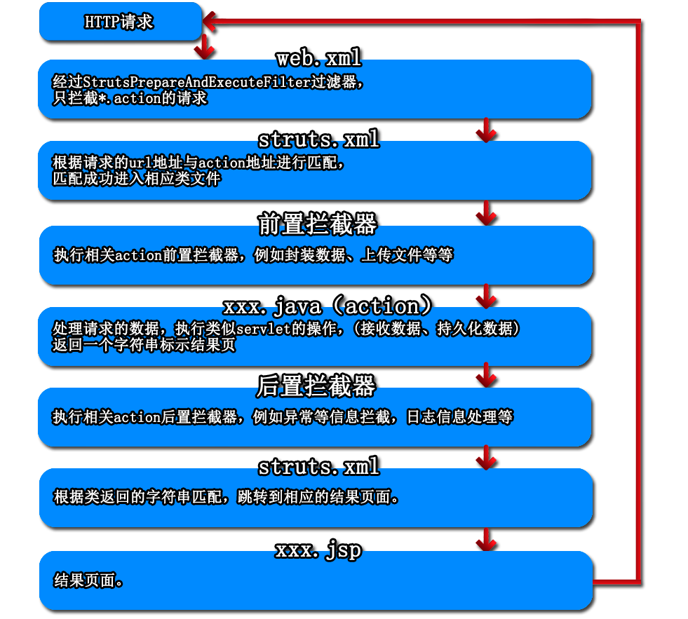
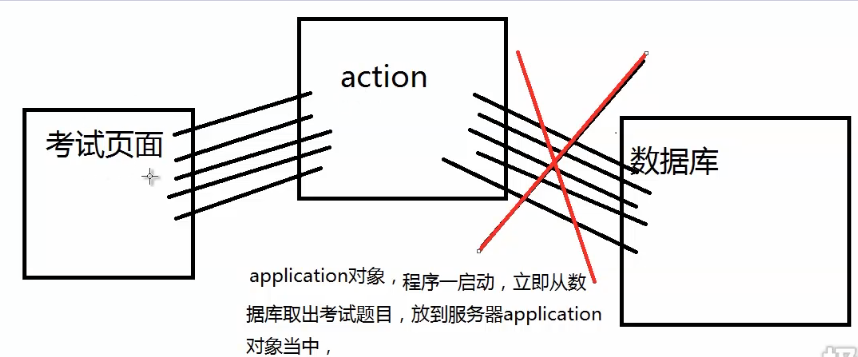
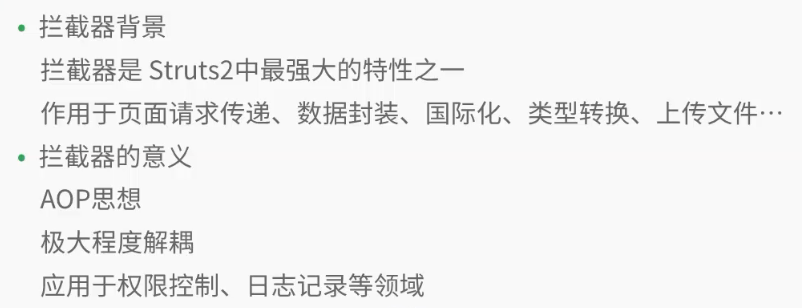
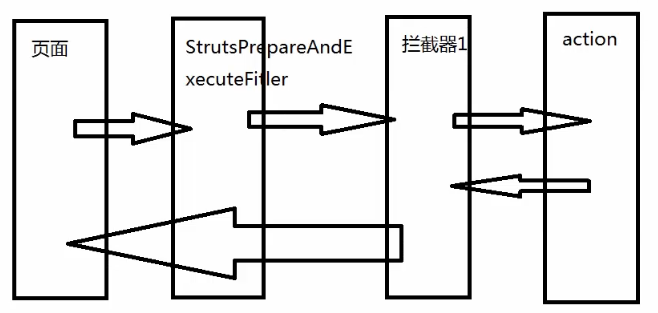
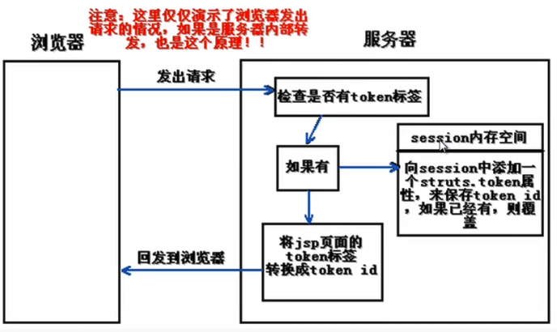
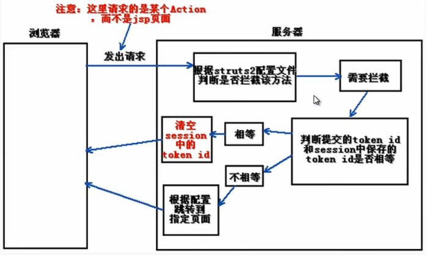
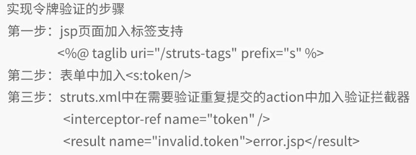
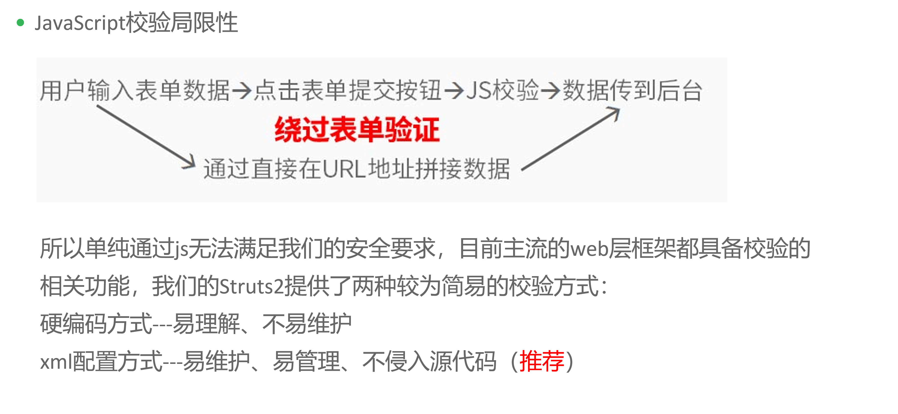

### Struts2

1. 创建与包导入

   参考：https://www.jianshu.com/p/ef5b9ed1cdb8

   也可以参考视频：https://www.jikexueyuan.com/course/697.html

   * **手动导入支持包创建**
     * 把依赖包（可以用官方给的示例解压得到）放入lib目录下
     * 把struts.xml复制到src文件夹下
       * 如果联网会自动导入dtd文件
       * 也可以手动导入dtd文件（xml catalog）
     * 在web.xml配置核心过滤器及映射文件
   * **自动通过IDE创建**

2. 不自动生成web.xml的问题

   参考：https://blog.csdn.net/smallbabylong/article/details/78726503

3. 配置文件解析（struts2-2）

   * 概览

     ```xml
     <!--配置根元素-->
     <struts>
         <!--bean 标签用于创建一个javabean实例-->
         <!--constant标签用于Struts2默认行为标签-->
         <!--package标签包标签 用于区分不同的请求文件的标签
            比如：网站前台请求 网站后台请求-->
         <!--include标签用于引入其他的xml配置文件-->
     </struts>
     ```

   * constant标签

     ```xml
     <!--配置web默认编码集 相当于HttpServletRequest。setCharacterEncoding用法-->
     <constant name="struts.i18n.encoding" value="UTF-8"></constant>
     <!--默认我们请求的后缀是.action(只拦截.action的请求)，如果不配置该元素，action/do都可以-->
     <constant name="struts.action.extension" value="action,do"></constant>
     <!--设置浏览器是否缓存静态内容，默认值是true，开发阶段建议使用false，防止修改后测试不到-->
     <constant name="struts.serve.static.browserCache" value="false"></constant>
     <!--当struts配置文件修改后是否自动重新加载，默认flase-->
     <constant name="struts.configuration.xml.reload" value="true"></constant>
     <!--开发模式下使用，可以打印出更加详细的错误信息-->
     <constant name="struts.devMode" value="true"></constant>
     <!--默认视图主题-->
     <constant name="struts.ui.theme" value="simple"></constant>
     ```

   * package

     ```xml
      <!--name属性：包名，用于被别的包调用或者继承
         extends:继承哪个包，会继承该包下配置信息和拦截器等等
         namespace：选填，url连接必须加入/new/action.xxx-->
     <package name="test" namespace="/new" extends="struts-default">
         <!--action相当于以前的servlet概念，对应一个请求的name为请求的url
            localhost:8080/login.do-->
         <action name="login" class="LoginAction">
             <result name="success">/success.jsp</result>
             <result name="fail">/fail.jsp</result>
         </action>
     </package>
     ```

     ```
     1.对于同一个<package>下两个name属性相同的<action>,struts2是这样处理的，后面的<action>将覆盖前面的<action>

     2.对于同一个<action>下两个name属性相同的<result>，struts2是这样处理的，后面的<result>将覆盖前面的<result>

     3.配置文件中两个同name属性的<package>(无论是否在同一xml文件中)，struts2是这样处理的，启动tomcat时，会报错。

     4.配置文件中两个不同name属性，但namespace属性相同的<package>，struts是这样处理的，将两个<package>下的<action>合并，遇到相同name属性的<action>时，后面<package>定义的<action>将覆盖前面<package>的<action>
     ```

4. 配置web.xml

   * 示例

     ```xml
     <welcome-file-list>
         <welcome-file>index.jsp</welcome-file>
     </welcome-file-list>
     <filter>
         <filter-name>filter</filter-name>
         <filter-class>org.apache.struts2.dispatcher.ng.filter.StrutsPrepareAndExecuteFilter</filter-class>
     </filter>
     <filter-mapping>
         <filter-name>filter</filter-name>
         <url-pattern>*</url-pattern>
     </filter-mapping>
     ```

5. 项目走转流程

   * Http请求流转

     

   * 配置文件连接点详述

     

   ​

6. 数据封装机制（struts2-3）

   * 属性和模型驱动

     * 传统方法

       ```java
       //传统方法代码量大 操作比较机械重复
       String username=request.getParameter("username");
       String password=request.getParameter("password");
       User user=new User(username,password);
       //struts2提供自动获取封装数据
       ```

     * 属性驱动（Struts2-3/action/LoginAction.java）

       **表单中的name值和action中属性的名称一致**

       LoginAction.java(**属性一定要设置Getter和Setter**)

       ```java
       public class LoginAction extends ActionSupport {
           private String username;//getter setter
           private String password;
           @Override
           public String execute() throws Exception {
               System.out.println(username);
               System.out.println(password);
               return "success";
           }
       }
       ```

       struts.xml

       ```xml
       <package name="userLogin" extends="struts-default">
               <action name="loginAction" class="action.LoginAction">
                   <result name="success">/index.jsp</result>
               </action>
       </package>
       ```

       index.jsp

       ```jsp
       <form action="<%=path %>/loginAction.action" method="post">
         username:<input type="text" name="username"><br>
         password:<input type="password" name="password"><br>
         <input type="submit" value="提交">
       </form>
       ```

     * 模型驱动（Struts2-3/action/MLoginAction.java）

       编写pojo类（**表单提交的name值与实体类中的属性名一致**）

       MLoginAction.java(**实现ModelDriven\<T>接口 且实例化一个对象** )

       ```java
       public class MLoginAction extends ActionSupport implements ModelDriven<Users> {
           private Users user=new Users();
           @Override
           public String execute() throws Exception {
               System.out.println(user.getUsername());
               System.out.println(user.getPassword());
               return "success";
           }

           @Override
           public Users getModel() {
               return user;
           }
       }
       ```

       struts.xml(**引用两个拦截器**)

       ```xml
       <package name="userLogin" extends="struts-default">
           <action name="muserLogin" class="action.MLoginAction">
               <result name="success">/index.jsp</result>
               <interceptor-ref name="modelDriven"></interceptor-ref>
               <interceptor-ref name="defaultStack"></interceptor-ref>
           </action>
       </package>
       ```

     * 标签实现模型驱动（Struts2-3/action/SLoginAction.java）

       SLoginAction.java（**需要对象 但是不需要实例化**）

       ```java
       public class SLoginAction  extends ActionSupport{
           //无需实例化 但是需要实现getter setter
           private Users user;

           @Override
           public String execute() throws Exception {
               user.getUsername();
               user.getPassword();
               return "success";
           }
       }
       ```

       index.jsp(**引用struts标签库  action只需要写配置文件中的名字 不需要写全路径**)

       （**user.username 需要对应pojo类以及Action中实例的名字**）

       ```jsp
       <%--引用struts标签库--%>
       <%@ taglib prefix="s" uri="/struts-tags" %>

       <h1>标签模型驱动/h1>
         <%--action只需要写配置文件中的名字 不需要写全路径--%>
         <s:form namespace="/userlogin" action="suserlogin" method="post">
         <s:textfield name = "user.username"/>用户名：
         <s:password name = "user.password"/>密码：
         <s:submit value="提交"  />
       </s:form>
       ```

       struts.xml

       ```xml
       <package name="userLogin" extends="struts-default">
           <action name="suserLogin" class="action.SLoginAction">
               <result name="success">/index.jsp</result>
           </action>
       </package>
       ```

   * 封装数据核心机制（Struts2-3mode）

     反射方法的调用

     * 当请求发送到action前
     * 调用MLoginAction类中getModel()获取要将数据表单封装到哪个实例化的对象中
     * 获得该对象后，我们可以获得类的类型
     * 获得类的类型之后，获得类中的属性
     * request.getParameters获得表单提交的所有数据名，从而获得值
     * 如果表单提交的name值与实体类中的属性名一致，那么我们将获得表单中的数据 封装到user对象中去

      BaseServlet->Loginservlet继承BaseServlet

7. Struts2 Web资源获取（Struts2-4）

   * 拦截器获得Web资源模式

     * 使用Struts2 Aware拦截器（FirstAction）
     * 使用Struts2 RequestAware拦截器（SecondAction）

   * 静态对象获取web资源模式

     * 使用Struts2内置静态对象ActionContext（ThirdAction）
     * **使用Struts2内置静态对象ServletActionContext（FourthAction）**(推荐使用)

   * 登录实例（LoginAction）

   * 关于servletContext (也就是application对象)

     * 服务器对象  只要服务器不关闭，那么这个信息永远存在
     * 该信息是存在服务器内存中的
     * 一般数据我们是严禁向application对象中放入的，容易导致服务器内存溢出，程序崩溃

     ```java
     //驾校考试系统，一般只要注册用户就可以免费使用，用户量庞大
     //每次只出现一个题，然后昨晚本道题自动跳到下一个题
     ```


     

8. Struts2 标签（Struts2-5）

   * OGNL概述

   * 表单标签

     * LoginAction

       ```java
       public class LoginAction extends ActionSupport {
           private Users us;

           @Override
           public String execute() throws Exception {
               System.out.println(us.getUsername());
               return "success";
           }

           public Users getUs() {
               return us;
           }

           public void setUs(Users us) {
               this.us = us;
           }
       }
       ```

     * 引入标签

       ```jsp
       <%@taglib prefix="s" uri="/struts-tags" %>
       ```

     * 编写表单

       us是因为在action中实例化对象的名字叫us

       ```jsp
       <s:form action="slogin" method="POST">
       	<s:textfield label="用户名" name="us.username"/>
           <s:password label="密码" name="us.password"/>
           <s:submit/>
       </s:form>
       ```

   * 逻辑控制标签

     * s:set

       ```jsp
       <%--以下两句话是等价的 向pageContext，request放入名称为age的值 61 --%>
       <%//request.setAttribute("age",61);%>
       <s:set name="age" value="61" ></s:set>

       <%--查看结果为61--%>
       <%=request.getAttribute("age")%>     61
       <%=pageContext.getAttribute("age")%> 61
       <%=session.getAttribute("age")%>     null
       <%=application.getAttribute("age")%> null
       ```

       ```jsp
       <s:set name="age" value="61" scope=></s:set>
       <%=request.getAttribute("age1")%>       null
       <%=pageContext.getAttribute("age1")%>   null
       <%=session.getAttribute("age1")%>       61
       <%=application.getAttribute("age1")%>   null
       ```

       ```jsp
       <s:set name="age2" value="61" scope="application" ></s:set>
       <%=request.getAttribute("age2")%>      null
       <%=pageContext.getAttribute("age2")%>  null
       <%=session.getAttribute("age2")%>      null
       <%=application.getAttribute("age2")%>  61
       ```

     * 见示例

9. Struts2拦截器（Struts2-6）

   * 概述

     

     

   * 通配符详解（Struts2-6）

     * 开启`actionName!methodName` 需要

       ```xml
       <constant name="struts.enable.DynamicMethodInvocation" value="true" />
       ```

     * 详解

       struts.xml

       - {1}指的是第几个*号代表的内容
       - 通过*来配置访问路径

       ```xml
       <struts>
           <package name="usersPackage" extends="struts-default">
               <action name="*_*" class="action.{1}Action" method="{2}">
                   <result name="{1}success">/{1}index.jsp</result>
               </action>
           </package>

       </struts>
       ```

       index.jsp

       * News_add 对应*_\*，{1}==News，{2}==add，从而去struts.xml寻找对应的action

       ```jsp
       <a href="<%=path%>/Users_add">添加</a><br>
       <a href="<%=path%>/Users_show">查看</a><br>
       <a href="<%=path%>/Users_delete">删除</a><br>
       <a href="<%=path%>/Users_update">修改</a><br>

       <hr>~~~~~~~~~~~~~~~~~~~~~~~~~~~~~~~~~~~~~~~~~~~~~~~</hr><br>

       <a href="<%=path%>/News_add">添加</a><br>
       <a href="<%=path%>/News_show">查看</a><br>
       <a href="<%=path%>/News_delete">删除</a><br>
       <a href="<%=path%>/News_update">修改</a><br>
       ```

       UsersAction.java

       * 返回值对应{1}success以及跳转{1}index.jsp

       ```java
       public String show() throws Exception {
               System.out.println("进入show：");
               return "Userssuccess";
        }
       ```

   * 拦截器的实现（Struts2-6/interceptor）

     * 拦截器的实现

     * 拦截器的访问顺序

     * interceptor-stack（多个拦截器打包，“**记得打包系统默认的拦截器**”）

       ```xml
       <interceptors>
           <interceptor name="First" class="interceptor.FirstInterceptor">
               <param name="someThing">admin</param>
           </interceptor>
           <interceptor name="Second" class="interceptor.SecondInterceptor">
           </interceptor>
           
           <interceptor-stack name="All_interceptor">
               <interceptor-ref name="First"></interceptor-ref>
               <interceptor-ref name="Second"></interceptor-ref>
               <interceptor-ref name="defaultStack"></interceptor-ref>
           </interceptor-stack>
       </interceptors>

        <action name="loginAction" class="action.LoginAction">
           <interceptor-ref name="All_interceptor"></interceptor-ref>
           <result name="success">/login.jsp</result>
        </action>

       ```

     * 设置新的默认拦截器

       ```xml
       <default-interceptor-ref name="All_interceptor"/>
       ```

     * 全局的返回

       ```xml
       <global-results>
           <result>/error.jsp</result>
       </global-results>
       ```

     * 方法拦截器（MethodInterceptor）

       * 继承MethodFilterInterceptor

       * 配置

         ```xml
         <interceptor name="MethodInter" class="interceptor.MethodInterceptor">
             <param name="includeMethods">add,delete</param>
         </interceptor>
         ```

         ```xml
         <action name="*_*" class="action.{1}Action" method="{2}">
             <interceptor-ref name="MethodInter"></interceptor-ref>
             <interceptor-ref name="defaultStack"></interceptor-ref>
             <result name="{1}success">/{1}index.jsp</result>
         </action>
         ```

       * 结果

         ```
         进入method方法拦截器
         进入add：
         走出method方法拦截器
         进入show：
         进入method方法拦截器
         进入delete：
         走出method方法拦截器
         进入update：
         ```

   * 控制登录实例

     当登录成功前，所有查看请求被拦截，登录成功后，用户名保留在session中，再请求查看信息会被允许。

     * CheckLoginInterceptor.java

       ```java
       public String intercept(ActionInvocation actionInvocation) throws Exception {
           System.out.println("进入check login拦截器");
           String url="";
          if(null!=ServletActionContext.getRequest().getSession().getAttribute("username"))	{
           	url=actionInvocation.invoke();
           }else{
               url="fail";
           }
           System.out.println("离开check login拦截器");
           return url;
       }
       ```

     * LoginAction.java

       当用户为admin时，存入session

       ```java
       public class LoginAction extends ActionSupport {
           private String username;
           @Override
           public String execute() throws Exception {
               System.out.println("进入LoginAction");
               if(username.equals("admin")){
               ServletActionContext.getRequest().getSession().setAttribute("username",username);
                   return "success";
               }else{
                   return "fail";
               }

           }
         GETTER SETTER
       }
       ```

     * 配置

       ```xml
       <package name="SecondPackage" extends="struts-default">
           <interceptors>
               <interceptor name="checklogin" class="interceptor.CheckLoginInterceptor"/>

               <interceptor-stack name="default_interceptor">
                   <!--登录拦截器 登陆成功加入session  登录失败 直接跳转到登录界面-->
                   <interceptor-ref name="checklogin"></interceptor-ref>
                   <interceptor-ref name="defaultStack"></interceptor-ref>
               </interceptor-stack>
           </interceptors>

           <!--默认都要通过登录检查-->
           <default-interceptor-ref name="default_interceptor"/>

           <global-results>
               <result>/login.jsp</result>
           </global-results>

           <!--给登录开放拦截器-->
           <action name="loginAction" class="action.LoginAction">
               <interceptor-ref name="defaultStack"></interceptor-ref>
               <result name="success">/login.jsp</result>
               <result name="fail">/login.jsp</result>
           </action>

           <!--通过登录拦截器之后的结果，如果为成功登录 拦截器会直接返回fail-->
           <action name="salaryAction" class="action.SalaryAction" >
               <result name="success">/success.jsp</result>
               <result name="fail">/login.jsp</result>
           </action>

       </package>
       ```

10. 国际化和令牌

  * 国际化的背景和意义

    * 使软件具有切换界面的语言功能
    * 极大的简化国际化功能的实现

  * 国际化的实现（本质上通过i18n拦截器）

    1. struts.xml文件中加入

       ```xml
       <constant name="struts.custom.i18n.resources" valuse="message">
       ```

    2. 在struts.xml文件同目录下创建以下两个文件

       * message_en_US.properties(配置英文信息)
       * message_zh_CN.properties(配置中文信息)

    3. 在jsp中使用struts标签完成界面所有内容

  * 令牌机制的背景及意义

    * 解决重复提交表单问题
    * 利用token拦截器实现

  * 令牌生成流程图

    

  * 令牌验证流程图

    

  * 令牌机制的实现

    

    * 第一步：jsp页面加入标签支持

      ```jsp
      <%@ taglib prefix="s" uri="/struts-tags" %>
      ```

    * 第二步：表单中加入

      ```jsp
      <s:token></s:token>
      ```

    * 第三步：struts.xml中在需要验证重复提交的action中加入验证拦截器

      ```xml
      <interceptor-ref name="token" />
      <result name="invalid.token">repeatsubmit.jsp</result>
      ```

    * 见示例（struts2-7/LoginAction）

11. 数据校验

   * 背景和意义

     

   * 需求示例

     ```
     用户名：要求 不能为空！大于6位小于11位
     密  码：要求 不能为空！大于6位小于11位 两次密码一致
     年  龄：要求 0-150岁
     邮  箱：要求 不能为空！必须符合邮箱格式
     电  话：要求 不能为空！必须是电话格式（1(3/5/8)xxxxxxxx，或010-xxxxxxxx或	0531-xxxxxxxx）
     ```

   * 硬编码方式

     * 第一步：创建Struts2项目

     * 第二步：编写一个普通表单

     * 第三步：在jsp中加入`<%@ taglib uri="/struts-tags" prefix="s"%>`标签库支持

     * 第四步：jsp中加入struts2校验框架提供的两种校验级别错误：  

       * 属性级错误：    `<s:fielderror cssStyle="color:red;"/>`
       * Action级错误：`<s:actionerror cssStyle="color:red;"/>`

       通常属性校验失败我们将错误信息放入fielderror对象中action级别错误信息放入actionerror对象中

     * 第五步：创建Action类，配置到struts.xml中

       注意一定要配置一个result，name值为input，用于验证失败跳转页面 

     * 第六步：Action类中创建校验方法

       方法命名规则：validate+要验证的方法名（首字母大写）

       （例如：execute()方法，校验方法validateExecute()  即使action中有很多方法，也可以分开验证。

     * 第七步：完善校验方法中具体的判断

         错误信息共分为两种：FieldError和ActionError

         将错误信息放入Field域中：

         this.addFieldError("username","用户名不能为空"); 

         将错误信息放入Action域中：

         this.addActionError("请两次密码必须一致");  

         实际上会将错误信息放入Struts2默认栈队map集合中

         页面可以使用 ${errors.username[0]}来单独展示属性错误信息

         复杂验证例如邮箱、电话等判断需要用到正则表达式！

   * xml配置方式

     * 第一步：创建Struts2项目，创建实体类Users

     * 第二步：编写一个普通表单

     * 第三步：在jsp中加入<%@ taglib uri="/struts-tags" prefix="s"%>标签库支持

     * 第四步：jsp中加入

       struts2校验框架提供了两种校验级别错误：  

       属性级错误：    <s:fielderrorcssStyle="color:red;"/>

       Action级错误：<s:actionerror cssStyle="color:red;"/>

       单属性方式页面错误信息：${errors.username[0]}     

       对象方式页面错误信息：${errors["user.username"][0]}

     * 第五步：创建Action类，配置到struts.xml中

        注意一定要配置一个result，name值为input，用于验证失败跳转页面

     * 第六步：在action类同包下创建一个Xml配置文件

       该文件用于写校验信息

       命名规则：Action名-validation.xml（例:UserAction-validation.xml）

     * 第七步：编写UserAction-validation.xml校验信息   

12. 类型转换器

   * 局部类型转换器（只作用于一个action，示例struts2-9）

     20100101日期格式类型转换器

     * 第一步：创建自定义类型转换器类，继承DefaultTypeConverter类

       重写其中的convertValue方法

     * 第二步：创建局部转换器配置文件

       名字格式：ActionName-conversion.properties

       文件位置：action类同包下

       内容：属性名=自定义转换器路径

       例（times =coverter.DateTypeConverter）

   * 全局类型转换器（作用所有action类，示例struts2-91）

     自定义坐标类转换

     * 第一步：创建自定义类型转换器类，继承DefaultTypeConverter类

       重写其中的convertValue方法

     * 第二步：创建全局转换器配置文件

       名字格式：xwork-conversion.properties

       文件位置：项目根目录，src下

       内容：类型名=自定义转换器路径

       例（java.util.Date=coverter.DateTypeConverter）